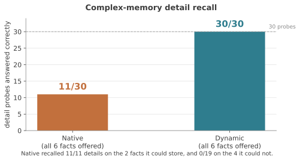
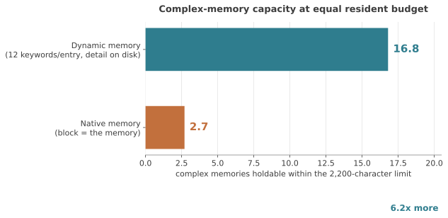
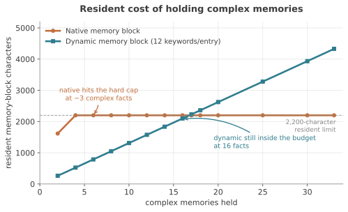

# hermes-dynamic-memory

**A ~400-token keyword index lives in the system prompt; verbose topic files
stay on disk; a plugin keeps the index well-formed.**

A production-tested memory pattern for personal AI agents. No vector database,
no embedding calls, no retrieval infrastructure — one index file and a
convention.

---

## Benchmark: complex memories

Most memory benchmarks count how many facts survive. The hard question is
whether **structured, detailed memories** survive — a migration policy with its
exceptions and named approver, an incident-severity definition with timing
thresholds, a deploy order with canary gates. These are what a lossy summary
destroys while keeping the headline.

Six such memories, each probed for every detail it contained; 30 probes per
system; clean containers, one fresh session per question, memory the only
possible source.

**Conditions:** model `deepseek 4.1 flash` (configured as `deepseek-chat`,
provider `deepseek`), Hermes v0.21.3, native cap 2,200 chars, 2026-09-19.
The model is part of the result — it prefers local filesystem evidence over
injected memory, which works *against* dynamic memory here. The same conditions
are stamped into every raw results file.

| | Native memory | Dynamic memory |
|---|---|---|
| detail probes answered correctly | **11 / 30** | **30 / 30** |
| complex memories held | 2 of 6 | **6 of 6** |
| resident cost to hold them | 1,615 chars | **503 chars** |

### Native memory does not degrade — it cuts off



Native kept 2 of 6 complex memories and **refused the other 4 outright**. On the
two it held, it recalled **every detail — 11 of 11**, including the named
approver and the 7-day snapshot rule. On the four it could not store, it
recalled **0 of 19**. Not degraded — zero. A memory is either fully present or
entirely absent, and which one depends only on arrival order.

### Capacity at an equal resident budget



With 12 keywords per entry — a **stated assumption**, since the real index
averaged 7 keywords and 82 chars per line, so the 12-keyword model (~131 chars
per line) is the conservative case:

| | complex memories in 2,200 chars |
|---|---|
| Native memory | **2.7** (measured) |
| Dynamic memory, 12 keywords/entry | **16.8** (projected) |
| Dynamic memory, as measured (7 kw/entry) | **26.8** |

**6.2× more** at the conservative 12-keyword rate.

### Resident cost



Native's resident block is flat-capped at 2,200 chars from the 4th memory
onward — more memories, same cost, no added capability. Dynamic's index grows
~130 chars per memory and stays inside the same budget until 16.

### What this means

Native's limit is **count, not depth**: a few memories held perfectly,
everything past that lost, with no way to prioritise. Dynamic memory trades a
keyword lookup for far more capacity, in full detail, at a fraction of the
resident cost.

Method and limitations: [`docs/complexity.md`](docs/complexity.md) ·
[`docs/cohort-50.md`](docs/cohort-50.md) · [`docs/compression.md`](docs/compression.md).
Verify without containers or API keys:

```bash
python3 benchmarks/scripts/run_complexity.py --verify-only
# native  : 11/30
# dynamic : 30/30
```

An independent clean re-run reproduced dynamic exactly and native in shape,
with the variance traced to reconstruction, not recall
([`benchmarks/REPRODUCTION.md`](benchmarks/REPRODUCTION.md)).

---

## The pattern

```markdown
# Memory Index — keyword,keyword,keyword → file.md
!!how,write,memory,format,keyword,entry,template → how-to-write-memories.md
!project,deploy,release,pipeline,staging,rollback → deploy-pipeline.md
java,springframework,jvm,garbagecollection,heap,profiling,jmx → java-performance.md
```

Every line is a pointer. A topic file can be as long as it needs — it costs
nothing until a conversation actually touches its keywords.

Always-on memory files fail differently: every fact competes for one character
budget, a once-a-month fact costs the same as a daily one, and useful history
must be deleted to make room. The fix is splitting memory into a **tiny
always-resident index** and **unlimited on-demand detail**.

```
                  session start
                       │
         ┌─────────────▼──────────────┐
         │ MEMORY.md  (~400 tokens)   │  injected into the system prompt
         │ keyword,keyword → file.md  │  as a frozen snapshot
         └─────────────┬──────────────┘
                       │  model evaluates the conversation
                       │  against the keyword SETS
         ┌─────────────▼──────────────┐
         │  read the best-matching    │
         │  topic file(s) in full     │
         └─────────────┬──────────────┘
                       ▼
   ~/.hermes/memories/<slug>.md    verbose markdown, unlimited size,
   (as many files as you need)     never in context unless routed to
```

Design rules:

- **One line per topic file**, 5–20 lowercase keywords: the floor forces you to
  think about lookup directions, the ceiling stops sprawl.
- **`!!` critical / `!` pinned prefixes are user-assigned only**; tagged lines
  are never reordered or pruned.
- **Ordering is access-driven**: most-read topics float to the top; when the
  index hits its cap, pruning happens at the bottom.
- **Pruning archives, never deletes**: evicted files move to
  `memories/archived memories/` under plain `.md` names, and their keyword
  lines move verbatim into a searchable archive index there
  ([`scripts/dynmem-watchdog.py`](scripts/dynmem-watchdog.py)).
- **Keywords are maintained with the file** — content without matching keywords
  is content nothing can reach.

## Retrieval: set-level matching with model-side fuzz

**The whole keyword set is scored, not single keywords.** For *"the java script
for the build is broken"*, per-keyword matching hits both `java` (JVM line) and
`javascript` (toolchain line) equally; set-level matching sees the toolchain
line's full set is denser and more specific, and routes correctly. That
collision class disappears.

**The model does the semantic work over a literal index.** *"My laptop's fans
won't stop spinning"* matches no keyword; the model makes the fans → `thermal`
jump and reads the hardware file. Fuzziness comes from the model already in the
loop — no vector store, no threshold, no API cost.

**The routing contract must be explicit.** Stock Hermes injects the index with
no instructions attached. Without a rule stating that the lines are a routing
table, a capable model still finds the right file — by brute-force filesystem
search, which does not scale. The [`skill/`](skill/) file carries the rule;
otherwise put it in your personality file or system prompt:

> Your memory index is a routing table, not a summary. When the conversation
> touches several keywords from one line — or an obviously related term the
> line doesn't spell out — read that file in full before answering.

Test it: ask a question sharing **no** literal keyword with the index, then
check the transcript for `read_file` on the expected file. `search_files`
instead means the routing rule isn't reaching the model.

## Governance: the memory-shaper plugin

A self-editing memory is both the feature and the failure mode. The plugin
([`plugin/memory-shaper/`](plugin/memory-shaper/)) hooks tool calls and
enforces the structure:

| Failure mode | Guard |
|---|---|
| Index clobbering | `replace` must match exactly one line; may never drop more than one entry |
| Format drift | Lines validated on write: Unicode `→`, bare `*.md` targets, 5–20 keywords, no prose; rejections carry fix messages |
| Path tricks | Bare filenames only — no paths, no `../` |
| Write-vector bypass | `write_file`, `patch`, redirects, `tee`, `sed -i` all blocked when arguments reference the index |
| Audit lockout | Read tools always pass (path-sharing with `write_file` was a real bug, fixed in 1.4.2 and regression-tested) |
| Orphan rot | Validator flags unreachable files and dead pointers on every candidate write |

## Cost

| | |
|---|---|
| Session start (~60 lines / ~500 keywords) | ~350–500 tokens |
| Per retrieval | one file read, only when routed |
| Retrieval infrastructure | zero |

Designed for personal-scale memory: tens to low hundreds of topic files.
Beyond that, split by profile or by tier, not by reaching for a database.

## Install

1. **Plugin** — copy `plugin/memory-shaper/` to `~/.hermes/plugins/`, enable in
   `config.yaml`. Requires Hermes with pre/post tool-call hooks.
2. **Skill** — copy `skill/` to
   `~/.hermes/skills/system-administration/dynamic-memory/`.
3. **Adopt the format** — restructure your index into `keywords → file.md`
   lines and validate:
   ```bash
   python3 scripts/verify_index.py ~/.hermes/memories/MEMORY.md   # exits 0 = clean
   ```
4. **Verify the wiring, not just the logic:**
   ```bash
   python3 scripts/test_hook_cases.py    # hook logic (unit)
   hermes plugins doctor memory-shaper   # hook actually loaded
   python3 scripts/test_retrieval.py --last --expect <topic>.md --check-prompt
   ```
5. **Optional lifecycle automation** — run
   `python3 scripts/dynmem-watchdog.py --dry-run`, then schedule it (see
   `scripts/dynmem-watchdog.py` header for the delivery contract).

Tried layout first? `examples/memories/` is a synthetic demo that validates
clean, including a post-prune `archived memories/` directory.
Full walkthrough of failure modes:
[`skill/references/diagnosing-recall-failure.md`](skill/references/diagnosing-recall-failure.md) —
every failure here is silent, so the reference exists to make them
distinguishable.

## Hermes compatibility

This project rides on Hermes' native memory file, so **Hermes updates can break
it.** Verified against v0.21.3. The native behaviours that force workarounds:
`ENTRY_DELIMITER` is hardcoded (bare `§` lines appear in the file; no plugin can
remove them), the injected block ships with no routing instruction, the default
cap is 2,200 chars (then the tool refuses writes and pushes "consolidate"),
`read_file`/`write_file` share a `path` argument (path-based locks must
whitelist reads), and the prompt view and file view of one entry disagree on the
separator. After upgrading Hermes:

```bash
hermes plugins doctor memory-shaper && python3 scripts/test_hook_cases.py
python3 scripts/verify_index.py ~/.hermes/memories/MEMORY.md
```

If a future Hermes adds its own detail tier, we call that success; the two
ideas worth borrowing regardless are the always-resident keyword index and
hook-layer enforcement.

## Also in this repo

- **Porting:** nothing here is Hermes-specific — an index file with
  `keywords → file.md` lines plus a system-prompt routing rule works in Claude
  Code, OpenClaw, OpenHands, or any file-tool agent. The plugin is hardening,
  not a requirement.
- **Prior art:** OpenHands keyword-triggered skills (per-skill triggers, no
  index), Claude Code auto-memory (prose descriptions, not keyword sets),
  pi-memory-tree (closest structural match), A-MEM/MemInsight (vector-backed),
  mem0/Cognee/Letta/Zep (database-backed, app-scale). This project adds set
  scoring, model-side fuzz over a literal index, hook-enforced governance, and
  tested tooling in one drop-in package.
- **Earlier benchmark rounds** ([`docs/benchmark.md`](docs/benchmark.md)):
  direct questions and zero-keyword fuzzy prompts were ties (12/12); only past
  the cap did native fail, by *consolidating* — one entry truncated, one
  dropped. The defensible claim is equivalent retrieval plus a far higher
  ceiling before loss, not better answers.

```
plugin/memory-shaper/        the enforcement plugin
skill/                       skill + diagnostic references
scripts/                     validator · watchdog · hook test · retrieval test
examples/                    synthetic demo index, topic files, archive, walkthrough
docs/                        architecture · three benchmark write-ups (+ raw results) · charts
benchmarks/                  fixtures, runners, reproduction report
```

## Limitations

- Routing quality is model-dependent; the index instructs, only the plugin
  forces.
- Keyword choice is the craft — vague keywords cost more than missing ones.
- No standardized benchmark numbers (LoCoMo and similar) yet; this is
  production engineering, not a research claim. PRs welcome.
- Single-user, single-machine by design; multi-agent via profile separation.
- Linux-validated; stdlib-only Python elsewhere, untested.

## License

Apache-2.0. **hermes-dynamic-memory by ockentap** —
https://github.com/ockentap/hermes-dynamic-memory
Redistributors must retain LICENSE and NOTICE and credit the project (see
NOTICE). Issues and PRs welcome — porting notes, validator edge cases,
benchmark results especially.
